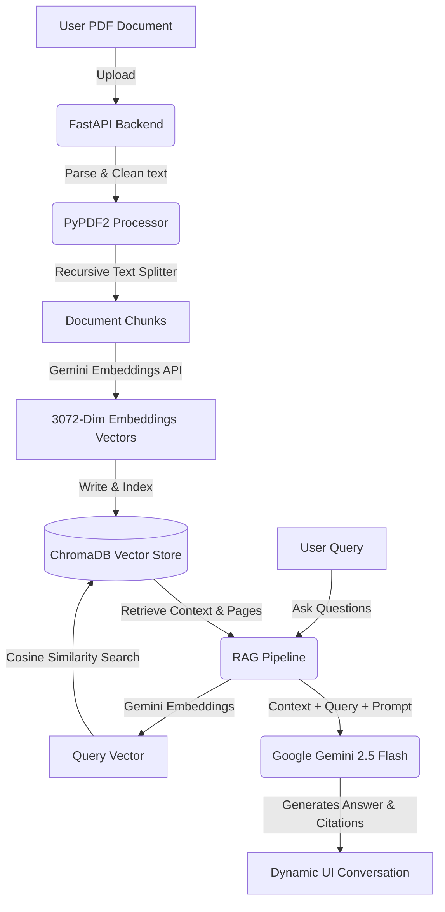

# ✨ Lumina - Premium AI PDF RAG Assistant ✨

Lumina is a state-of-the-art, visually stunning, and highly performant AI-Powered PDF Retrieval-Augmented Generation (RAG) assistant. Built with a sleek glassmorphic dark-mode interface, Lumina lets you upload PDF documents, automatically index their content with cloud-powered semantic embeddings, and chat with them in real-time with full contextual awareness, citation tracking, and inline PDF page-by-page viewing.

---

## 🌟 Key Features

* 🚀 **Lightning-Fast AI Answers**: Powered by **Google Gemini 2.5 Flash** for highly accurate, fast, and comprehensive answers.
* 🔍 **Premium Semantic Search**: High-dimensional vector indexing using Google Gemini's **3072-dimension embeddings**, ensuring precise retrieval of relevant sections even for complex queries.
* 📄 **Interactive PDF Side-by-Side Workspace**: Preview your uploaded PDF directly in the workspace while talking to your AI assistant.
* 🎯 **Reference Citations**: Automatically tracks, extracts, and highlights source pages and relevant text snippets used to formulate the AI's answers.
* 📊 **Smart Dashboard**: A beautifully designed dashboard to upload files, manage existing documents, and monitor indexing status.
* 🔐 **Seamless Local Auth**: Instant credentials validation supporting clean workspace separation for mock and registered users.
* 🎨 **Breathtaking Design Aesthetics**: Premium CSS typography, harmonious dark color palettes, sleek gradients, glassmorphism, responsive flex layouts, and delightful interactive micro-animations.

---

## 🏗️ Technical Architecture

Lumina separates indexing, semantic vector storage, and generation into a clean, modern, decouple-first architecture:



---

## 🛠️ Technology Stack

* **Frontend**: React 18, Vite, TypeScript, Vanilla CSS (harmonious HSL palettes, glassmorphism, custom micro-animations), Lucide React.
* **Backend**: FastAPI (Python 3.10+), Uvicorn, PyPDF2, ChromaDB (Vector DB), Google Generative AI SDK.
* **AI Engine**: Google Gemini API (`models/gemini-2.5-flash` and `models/gemini-embedding-001`).

---

## 🚀 Quick Start Guide

Follow these steps to set up and run Lumina locally on your machine.

### 1. Prerequisites
* Python 3.10 or higher
* Node.js (v18 or higher) & npm
* A **Google Gemini API Key** (Get one free from [Google AI Studio](https://aistudio.google.com/))

---

### 2. Backend Setup (`/backend`)

1. **Navigate to backend folder**:
   ```bash
   cd backend
   ```

2. **Create and activate a virtual environment**:
   * **Windows (PowerShell)**:
     ```powershell
     python -m venv venv
     .\venv\Scripts\Activate.ps1
     ```
   * **macOS/Linux**:
     ```bash
     python3 -m venv venv
     source venv/bin/activate
     ```

3. **Install Dependencies**:
   ```bash
   pip install -r requirements.txt
   ```

4. **Configure Environment Variables**:
   Create a `.env` file in the `backend/` directory (you can copy `.env.example` as a template):
   ```env
   PORT=8000
   GOOGLE_API_KEY=your_gemini_api_key_here
   ```

5. **Start the Backend Server**:
   ```bash
   python -m uvicorn app.main:app --port 8000 --reload
   ```
   The backend server will start running at `http://localhost:8000`.

---

### 3. Frontend Setup (`/frontend`)

1. **Navigate to frontend folder**:
   ```bash
   cd ../frontend
   ```

2. **Install Packages**:
   ```bash
   npm install
   ```

3. **Configure Environment Variables**:
   Create a `.env` file in the `frontend/` directory (or copy `.env.example`):
   ```env
   VITE_API_URL=http://localhost:8000/api
   ```

4. **Start the Development Server**:
   ```bash
   npm run dev
   ```
   Open `http://localhost:5173` in your browser to experience Lumina!

---

## ⚙️ Environment Variables Detailed Checklist

### Backend `.env`
| Variable | Description | Example |
| :--- | :--- | :--- |
| `GOOGLE_API_KEY` | Your Google AI Studio API key used for RAG generation and embedding. | `AIzaSy...` |
| `PORT` | Local port for FastAPI. | `8000` |

### Frontend `.env`
| Variable | Description | Example |
| :--- | :--- | :--- |
| `VITE_API_URL` | Endpoint of the FastAPI backend router. | `http://localhost:8000/api` |

---

## 🎨 Premium UI Aesthetics

Lumina's design is heavily tailored for visual brilliance:
* **Backgrounds**: Deep, cohesive background gradients (`#080710` to `#0f0c1b`) combined with colorful structural glass containers.
* **Buttons**: Elegant hover shifts with subtle glow highlights and smooth `transition: all 0.3s ease`.
* **Scrollbars**: Customized, minimal styling to integrate flawlessly with dark mode.
* **Layout**: Perfectly centered CSS grids, flexible layouts, and modern sidebar workspaces that feel professional.

---

## 📝 License
This project is open-source and available under the MIT License.
