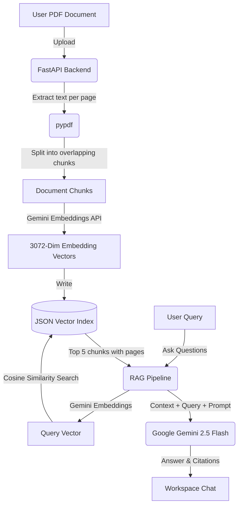

# ✨ Lumina - Premium AI PDF RAG Assistant ✨

Lumina is an AI-powered PDF Retrieval-Augmented Generation (RAG) assistant with a sleek monochrome, glassmorphic interface. Upload PDF documents, index their content with Gemini embeddings, and chat with them with source citations, Markdown answers, generated summaries, and a side-by-side PDF viewer.

---

## 🌟 Key Features

* 🚀 **Grounded AI Answers**: Powered by **Google Gemini 2.5 Flash**, answering only from the retrieved document context.
* 🔍 **Semantic Search**: Google Gemini's **3072-dimension embeddings** (`gemini-embedding-001`) find the most relevant passages for every question.
* 📄 **Side-by-Side Workspace**: Preview the uploaded PDF and its extracted page text while chatting.
* 🎯 **Reference Citations**: Every answer lists the pages and chunks it was built from.
* 📝 **Summaries**: One-click summaries with key takeaways.
* 📊 **Dashboard**: Upload, open, and delete your documents.
* 🔐 **Supabase Auth**: Email/password sign-in, with every API request verified on the backend.

---

## 🏗️ Technical Architecture



* PDFs are stored in `backend/uploads/`, document metadata in `backend/uploads/metadata.json`, and one vector index per document in `backend/chroma_db/`. Set `DATA_DIR` to move both folders, e.g. onto a persistent disk.
* Without a `GOOGLE_API_KEY`, the backend still runs using keyword embeddings and extractive answers, which is useful for offline development but much less accurate.

---

## 🛠️ Technology Stack

* **Frontend**: React 19, Vite 8, TypeScript, Tailwind CSS v4, Framer Motion, Lucide React, React Router, Supabase JS, React Markdown.
* **Backend**: FastAPI (Python 3.12), Uvicorn, pypdf, Google Gen AI SDK (`google-genai`), PyJWT.
* **AI Engine**: Google Gemini API (`gemini-2.5-flash` and `gemini-embedding-001`).
* **Auth**: Supabase Auth. The backend verifies access tokens with the project's JWT signing keys (JWKS) or the legacy JWT secret.

---

## 🚀 Quick Start Guide

### 1. Prerequisites
* Python 3.12
* Node.js 22.13+ (or 20.19+) & npm
* A **Google Gemini API Key** from [Google AI Studio](https://aistudio.google.com/apikey)
* A **Supabase project** with email auth enabled (optional for local development, see `AUTH_BYPASS`)

---

### 2. Backend Setup (`/backend`)

1. **Create and activate a virtual environment**:
   * **Windows (PowerShell)**:
     ```powershell
     cd backend
     python -m venv .venv
     .\.venv\Scripts\Activate.ps1
     ```
   * **macOS/Linux**:
     ```bash
     cd backend
     python3 -m venv .venv
     source .venv/bin/activate
     ```

2. **Install dependencies**:
   ```bash
   pip install -r requirements.txt
   ```

3. **Configure environment variables**: copy `.env.example` to `.env` and fill it in. For local development without Supabase, set `AUTH_BYPASS=true`.

4. **Start the backend server**:
   ```bash
   python -m uvicorn app.main:app --port 8000 --reload
   ```
   The API runs at `http://localhost:8000`, with interactive docs at `http://localhost:8000/docs`.

---

### 3. Frontend Setup (`/frontend`)

1. **Install packages**:
   ```bash
   cd frontend
   npm install
   ```

2. **Configure environment variables**: copy `.env.example` to `.env`. For local development without Supabase, set `VITE_BYPASS_AUTH=true` (together with `AUTH_BYPASS=true` on the backend).

3. **Start the development server**:
   ```bash
   npm run dev
   ```
   Open `http://localhost:5173`. The Vite dev server proxies `/api` to the backend on port 8000.

---

## ⚙️ Environment Variables

### Backend `.env`
| Variable | Description | Example |
| :--- | :--- | :--- |
| `GOOGLE_API_KEY` | Google AI Studio API key for embeddings and answers. | `your-gemini-api-key` |
| `SUPABASE_URL` | Supabase project URL; used to fetch the JWT signing keys that verify user tokens. | `https://your-project-ref.supabase.co` |
| `SUPABASE_JWT_SECRET` | Only for projects still using the legacy shared JWT secret. | *(empty)* |
| `AUTH_BYPASS` | `true` skips token verification. **Local development only.** | `false` |
| `ALLOWED_ORIGINS` | Comma-separated frontend origins allowed by CORS. | `https://your-app.vercel.app` |
| `DATA_DIR` | Folder for uploads and vector indexes. Defaults to `backend/`. | `/var/data` |
| `MAX_UPLOAD_MB` | Largest accepted PDF. | `20` |
| `GEMINI_MODEL` / `EMBEDDING_MODEL` | Optional model overrides. Changing the embedding model requires re-uploading documents. | `gemini-2.5-flash` |

### Frontend `.env`
| Variable | Description | Example |
| :--- | :--- | :--- |
| `VITE_SUPABASE_URL` | Supabase project URL. | `https://your-project-ref.supabase.co` |
| `VITE_SUPABASE_ANON_KEY` | Supabase publishable (anon) key. | `sb_publishable_...` |
| `VITE_API_BASE_URL` | Backend API base URL. Use `/api` locally; the deployed backend URL in production. | `/api` |
| `VITE_BYPASS_AUTH` | `true` signs in with a local mock user. **Local development only.** | `false` |

> 🔒 Never commit `.env` files. Only the `.env.example` templates belong in git.

---

## ☁️ Deployment

### Backend on Railway
1. Create a service from this GitHub repo and set its **Root Directory** to `/backend`. Railpack installs `requirements.txt`, uses Python from `.python-version`, and starts the API with the command in `railpack.json`.
2. Attach a **volume** (for example at `/data`). The backend stores uploads and indexes there automatically through `RAILWAY_VOLUME_MOUNT_PATH`.
3. Add the backend environment variables (`GOOGLE_API_KEY`, `ALLOWED_ORIGINS`, and either the Supabase settings or `AUTH_BYPASS`), then generate a public domain.

### Frontend on Vercel
1. Import this GitHub repo and set the **Root Directory** to `frontend` (Vite is detected automatically; `vercel.json` handles client-side routes).
2. Set `VITE_API_BASE_URL` to `https://<your-railway-domain>/api` plus the Supabase or bypass variables, and deploy.
3. Add the Vercel URL to the backend's `ALLOWED_ORIGINS`.

---

## 🎨 UI Design

* **Palette**: A monochrome black-and-white theme with translucent glass cards and a subtle grid backdrop.
* **Motion**: Framer Motion page transitions, hover lifts, and a typing indicator while answers stream in.
* **Layout**: Responsive dashboard grid and a two-panel workspace with the PDF viewer beside the chat.

---

## 📝 License
This project is open-source and available under the MIT License.
